# LangGraph

langgraph 是一个任务编排系统，核心：
1、节点：工作流中的计算单元
2、边：定义节点之间的流向
3、状态：节点之间传递和共享信息

和Langchain之间的区别：

LangChain的忒多那就是LCEL，也就是表达式语言，会将每一个节点串联起来，形成一个链条。（有向无环图）

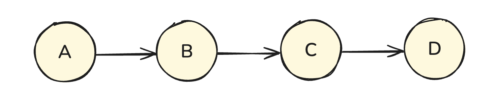

LCEL 的优势在于简洁、高效和易于理解。但是因为是无环图，意味着工作流中的数据不回流，因此这种线性特性在处理复杂动态的工作流中存在局限。特别是在需要迭代循环或者多智能体协作的场景中，DAG的架构就会显得不行。LangGraph 则是弥补了 LCEL 在处理复杂工作流方面的不足，它采用的是有向循环图（Directed Cyclic Graph，DCG）

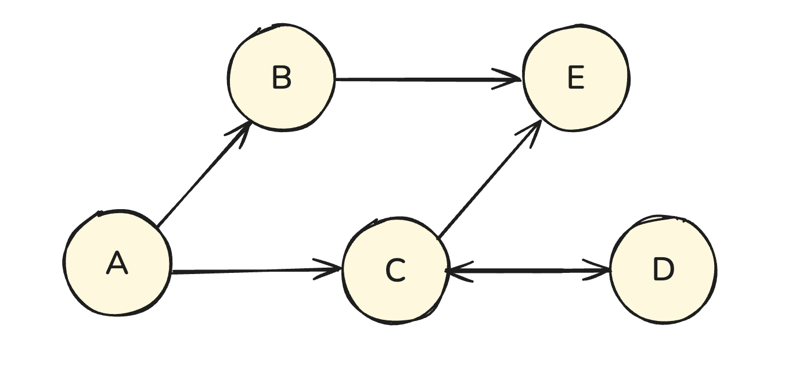

DCG 允许在工作流图中存在环路，这意味着数据可以在节点间循环流动，工作流迭代执行，并且根据状态或条件动态回溯。这一架构使得 LangGraph 能够处理复杂的状态化迭代工作流。

在最新的1.0版本开始，使用 `createAgent` API的时候，默认就是基于 `LangGraph` 实现的。

**两者在实际开发中的关系**：

- LangChain：在实际开发中，如果智能体应用需求很简单，那么使用 LangChain 就够了。
- LangGraph：如果涉及到复杂的任务流，那么就需要 LangGraph 来做任务编排。

使用 LangGraph 的时候，虽然说它可以完全独立使用，在实际 AI 项目中，我们通常会在节点中调用 LLM、工具、消息等 LangChain Core 组件，因此两者常常配合使用，从而达到 1 + 1 > 2 的效果。如下图所示：

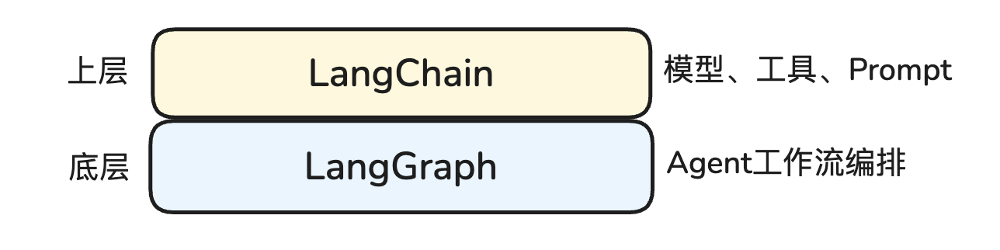

- 上层：LangChain 负责提供模型、工具、消息、Prompt 等基础抽象
- 底层：LangGraph 则负责将这些组件编排成一个可持久化、可中断、可恢复的工作流

> 总结：LangChain 解决“用什么组件”，LangGraph 解决“这些组件怎么按流程运行”

## 节点

节点是  LangGraph中的**基本构建单元**，代表智能体工作流中的一个个独立的计算单元或者操作步骤。

每个节点都封装了特定的功能逻辑，负责执行特定的人物。

**节点本质就是一个函数**，每个节点**接收当前状态**，返回部分**状态更新**。常见场景：

- 调用大模型
- 调用工具或API
- 执行业务逻辑
- 复用子图

因此划分类型为：

1. 大模型调用节点
2. 工具调用节点
3. 自定义函数节点
4. 子图节点

## 边

边用于在LangGraph中定义节点之间的链接和数据流向，决定了智能体工作流的**执行顺序**和逻辑。

主要类型：

1. 普通边
2. 条件边
3. 入口边
4. 条件入口点

## 状态

状态属于整个图的**全局数据容器**，用于节点之间的共享数据，运行过程中不断累加，而不是覆盖。

状态主要用语:

1. 上下文信息存储
2. 节点间数据传递
3. 状态持久化
4. 多智能体共享

# 图和子图概念

LangGraph 中的 graph 表示“图”的含义。

LangChain 团队借鉴了这一结构化思想，设计了 LangGraph，用图的形式来组织和控制多步骤任务的执行流程，解决了 LangChain 在构建复杂工作流时难以处理诸如分支、循环和错误恢复等问题。

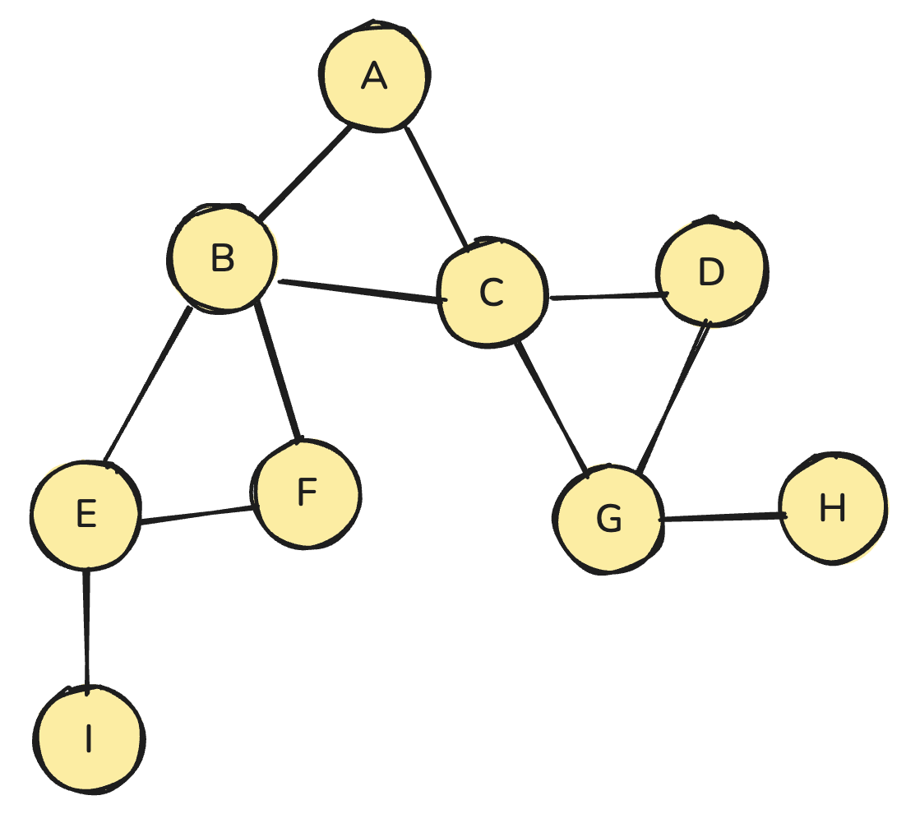

定点（顶点，对应英语 Vertex。指的是图里面的一个一个数据元素。）

相邻顶点：由一条边连接到一起的顶点称之为相邻顶点。

- A 和 B：相邻顶点
- C 和 D：相邻顶点
- A 和 E：不是相邻顶点

度：指的是相邻顶点的数量。

- A：2
- C: 4

如果有向图，还分为入度（入边）和出度（出边）。

路径：指的是一连串顶点序列

- A → B → E → I 形成一个路径
- A → C → D → G 也是一条路径

简单路径：不包含重复顶点的路径

环：指的是从某一个顶点出发，最后回到该顶点，其路径形成了闭环，则是一个环。

- A → B → C → A 是一个环

**无向图和有向图**： 顶点之间是存在方向的概念

- 没有方向：无向图
- 有方向：有向图

LangGraph 中的图是有向图，更准确地说，是一种有向状态转换图。

有向图的顶点之间有明确的方向。例如：

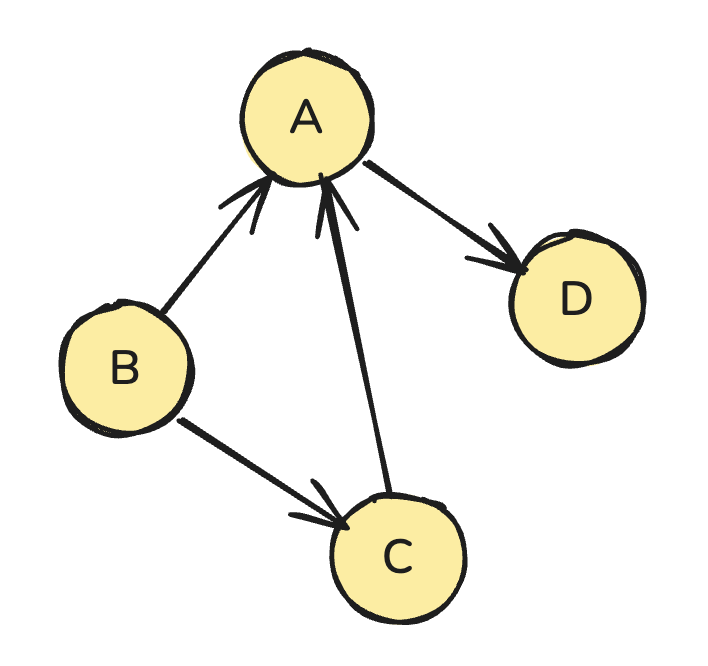

在有向图中，常用尖括号 <u, v> 表示一条从 u 指向 v 的边。

> 其中：第一个节点 u 是 tail（起点），第二个节点 v 是 head（终点），方向为 u → v。

上图为 G = (V,{E})，其中顶点集合 V = {A,B,C,D}，边集合 E = {<A,D>, <B,A>, <C,A>, <B,C>}。

在有向图中，如果任意两个顶点之间都存在方向相反的指向，称之为有向完全图。例如下图就是一个有向完全图：

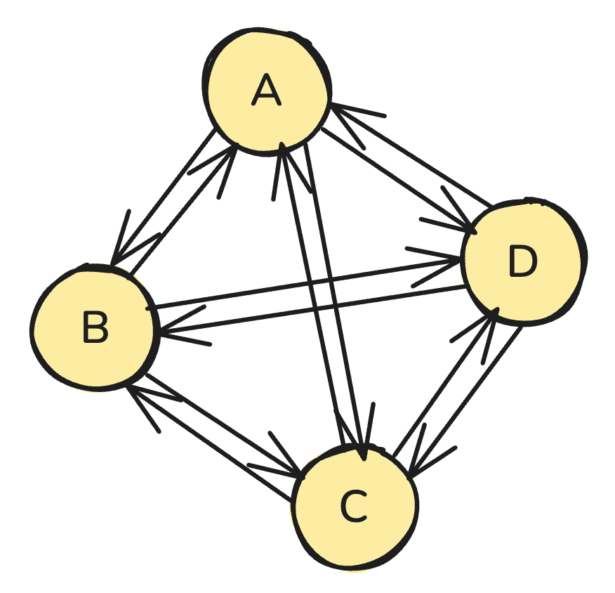

**子图** 假设有两个图，一个图是 `G = (V, {E})`，另一个图是 `G' = (V', {E'})`，如果

$$
\begin{aligned}
V' &\subseteq V \\
E' &\subseteq E
\end{aligned}
$$

那么我们称 G' 为 G 的子图。

例如：

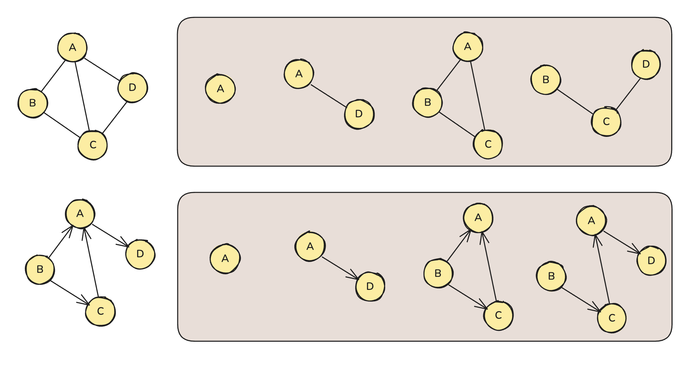

## 快速上手

ts版本安装:

```bash
pnpm add langchain @langchain/core @langchain/langgraph @langchain/ollama readline-sync zod
```

定义状态 -> 创建工作流 -> 创建节点 -> 构建图 -> 开启对话

## 状态

开始构建一个图的时候，优先考虑的是先将这个图的状态定义好，因为所有节点都需要往这里面写东西、改东西，相当于一个全局状态表。

State主要包括两块内容:

1. Schema 状态结构说明书
2. Reducer 状态合并规则

### Schema

**Schema** 用来做状态的结构约束，统一规定:

- 这个图里的全局状态长什么样
- 有哪些字段、字段类型、哪些是字段是必须的

在官方推荐的两种定义方式：

- Zod Schema （推荐）
- Annotation API

默认情况下，图的输入 schema = 输出 schema，一个节点进来的 state 和最终输出的 state 的结构是一致的。

可以分别指定 input schema 和 output schema

```ts
// 输入Schema
const inputSchema = z.object({
  query: z.string(),
});
// 输出Schema
const outputSchema = z.object({
  query: z.string(),
  answer: z.string(),
  metadata: z.object({
    model: z.string(),
    tokens: z.number(),
    duration: z.number(),
  }),
});
// 在实例化图的时候，传入两个Schema
new StateGraph({
  input: inputSchema,
  output: outputSchema
})
```

python 版本定义

```python
from langchain.messages import AnyMessage
from typing_extensions import TypedDict, Annotated
import operator


# 带有operator.add的Annotated类型确保新消息被追加到现有列表中，而不是替换它。
class MessagesState(TypedDict):
    messages: Annotated[list[AnyMessage], operator.add]
    llm_calls: int

```

官方文档: [multiple-schemas](https://docs.langchain.com/oss/javascript/langgraph/graph-api#multiple-schemas)

### Reducer

状态合并起，节点不会直接改整份state，而是丢回一些更新片段，reducer决定这些更新如何和旧状态数据进行合并，默认是覆盖

工作原理：

1. 节点只需要返回要更新的那一小块数据，不用整个 state 抄一遍
2. 如果没有为某个 key指定reducer ，就按默认策略：直接覆盖，后来的值把前面的值覆盖掉
3. 每个 key 可以有各自的合并方式，例如 number 怎么合并？array 怎么合并？

### Message

在很多 Agent场景里，我们需要把上下文对话保存在 state.messages 里，供后续节点读取和追加。

```ts
import * as z from "zod";
import type { BaseMessage } from "@langchain/core/messages";

// 定义 Schema
const Schema = z.object({
  messages: z.array(z.custom<BaseMessage>()), // 就是用来存储对话的
  llmCalls: z.number().optional(),
});
```

回忆如何更新这个 state.message 的？

```ts
async function llmNode(state: TState) {
  const result = await chain.invoke({
    messages: state.messages,
  });

  return {
    messages: [...state.messages, result], // 手动进行更新的
    llmCalls: (state.llmCalls ?? 0) + 1,
  };
}
```

根据reducer的核心，只需要返回最新的数据就可以了，至于怎么更新，交给reducer来处理。

但是这里又会遇到一个问题，那就是 `state.messages` 不只是个简单的数组，它应该是一个 **可追加、可更新** 的消息里诶宝。如果活我们使用简单的数组，然后利用数组的 `conncat` 方法来追加消息，那么就只能实现追加，无法实现更新。

例如: 我们想更新一条 id 为 m-123的消息:

```ts
return { messages: [{ id: "m-123", content: "新内容" }] }
```

如果数组 concat:

```bash
旧：[{ id: "m-123", content: "旧内容" }]
新：[{ id: "m-123", content: "新内容" }]
```

concat 后:

```json
[
  { id: "m-123", content: "旧内容" },
  { id: "m-123", content: "新内容" }
]
```

这里并不是“更新”了这条消息，而是“复制 + 添了一条新的”。为了解决这个问题，官方推荐 **MessagesZodMeta**

```ts
import { StateGraph, MessagesZodMeta } from "@langchain/langgraph";
import { registry } from "@langchain/langgraph/zod";
// import * as z from "zod";
import { z } from "zod/v4";
import { BaseMessage } from "@langchain/core/messages";

const State = z.object({
  messages: z
    .array(z.custom<BaseMessage>()) // 用 BaseMessage 数组承载对话
    .register(registry, MessagesZodMeta), // 通过 MessagesZodMeta 绑定“按 id 合并/覆盖”的 reducer + 序列化逻辑

  // 还可以放其它业务字段
  documents: z.array(z.string()).optional(),
});

const graph = new StateGraph(State);

```

这里的 reducer 不是 concat，而是 MessagesZodMeta 内部的智能 reducer，它的特性：

1. 有ID的消息会进行覆盖，而不是追加

```ts
return { messages: [ new HumanMessage({ id: "m-123", content: "修正内容" }) ] }
```

2. 没有id的消息会追加到 messages 末尾

```ts
return { messages: [ new AIMessage("hi") ] }
```

使用 MessagesZodMeta 时，框架会把原始对象反序列化成 LangChain 的 Message 实例，因此下面两种写法都 OK：

```ts
// 直接传 Message 实例
{ messages: [new HumanMessage("hi")] }

// role/content 原始结构
{ messages: [{ role: "human", content: "hi" }] }

```

读取时使用面向对象的点语法，例如：

```ts
const last = state.messages[state.messages.length - 1];
console.log(last.content);
```

## 节点

节点的本质就是一个函数，这个函数可以是同步的，也可以是异步的，该函数会自动被框架包装成 RunnableLambda。

RunnableLambda 是 LangChain 提供的一种轻量级工具，它能把普通函数封装成符合 Runnable 接口规范的实例，从而让该函数能够无缝参与到 LCEL 的链式调用与流式处理流程中。

例如：

```ts
import { RunnableLambda } from "@langchain/core/runnables";

// 普通函数
const fn = (text) => {
  return text.toUpperCase();
};

// 将 fn 转换为 Runnable 类型函数
const runnableFn = RunnableLambda.from(fn);

await runnableFn.invoke("hello");
```

**节点参数** 在一个节点函数中，会传入两个参数:

1. `state` 图当前的状态，由 StateGraph控制
2. `config`: 一个 [RunnableConfig](https://reference.langchain.com/javascript/langchain-core/runnables/RunnableConfig) 类型的对象

通过 graph 的实例的 `addNode` 方法添加节点,

```ts
graph.addNode("myNode", (state, config) => {
    console.log("In node: ", config?.configurable?.user_id);
    return { results: `Hello, ${state.input}!` };
  })
  addNode("otherNode", (state) => {
    return state;
  })
```

可以看到，节点函数在经过一些处理后，会返回新的状态。

**默认节点** 如果不写节点名称，会自动取**函数名作为接点名**

```ts
function myNode(state) {
  return { ... };
}

graph.addNode(myNode);

// ==== graph.addNode("myNode", myNode);

```

**开始节点和结束节点**：

```ts
import { START,END  } from "@langchain/langgraph";

graph.addEdge(START, "nodeA");
graph.addEdge("nodeA", END);

```

START 是一个特殊的节点，表示图的起点。该节点并不做什么事情，只是代表一个开始的标识。

`addEdge(START, "nodeA")` 表示将 START 和 nodeA 相连，nodeA 其实是真正要运行的第一个实际节点。

END 也是一个特殊节点，表示图的结束,上面的 `addEdge("nodeA", END)` 表示将 nodeA 和 END 相连，而 END 表示终止执行、停止流程。

**缓存机制**: 某一些节点函数计算昂贵，可以选择将其缓存起来，这样下次有相同的输入时不用再重新执行节点，而是直接返回缓存结果。

要使用缓存，需要下面两个步骤：

1. compile() 编译图的时候，启用缓存 `pnpm add @langchain/langgraph-checkpoint`

```ts
// (表示整个图都使用内存缓存。)
// 也可以换成 Redis、file、database 等。
graph.compile({ cache: new InMemoryCache() });
```

2. 指定缓存策略

- `ttl`：缓存有效时长（秒），决定“缓存多久过期”，适用于想让缓存自动失效时。
- keyFunc：自定义缓存 key，决定“什么输入算同一个缓存”，适用于想**精细控制缓存命中逻辑时**.
  - LangGraph 在执行流程中有多个“检查缓存”的时机，而每个时机的 state 结构不同（有时已 reduce、有时未 reduce）
  - 因此 cachePolicy 的 keyFunc 会发生在 “reduce 前” 或 “reduce 后” 的不同位置，有可能拿到：
    - 单一 state
    - reducer 尚未处理的 state 数组

## 超步

并发: 统一时间段内，**多个人物交替进行** 。这些人物没有真正的同时运行，而是通过认为切换来营造同时进行的效果。

并发的特点，一个执行单元（单线程）通过任务调度来处理多个人物。

并行：**同一时刻，多个任务真正同时运行**。

> 在 LangGraph 中，采用的是并发的方式执行多个任务。

`Fan-out`（扇出）：指的是一个节点添加多个出边，将其同时链接到下游节点。当LangGraph执行到该节点时，会并发的触发所有出边

总结：一个节点链接多个下游节点

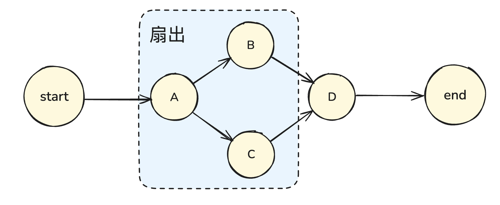

`Fan-in`（扇入）：指多个分支汇聚到同一个下游节点操作，实现扇入时，需要为目标节点添加多条入边，使其能够接收多个上游节点的输入

总结: 一个节点链接多个上游节点

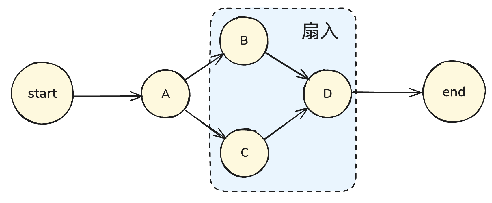

超步：超级步骤，图执行过程中的一个"批次轮次"，也就是有一轮统一调度的执行阶段。

在 langGraph中，超步的核心目的，是让多个节点能够在同一轮中并发执行，并在每一轮结束时进行全局同步。

LangGraph 中超步特点：

- 并发性：同一个超步内，多个节点可以并发执行，从而提升一个执行效率。
- 同步性：每个超步结束后，会有一个全局的同步点，同步全局状态，同步完成之后，才进入下一个超步。
- 迭代性：图执行的过程其实就是超步的迭代过程。每一个超步都是在前一个超步的状态基础上进行计算和更新的。

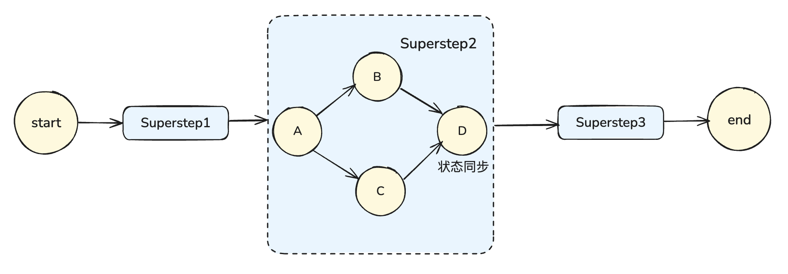

每个超步的执行流程，大致分为三步：

1. 就许节点并发执行
2. 统一同步借给哦
3. 解锁下一轮节点

## 边

边是两个节点的连接线，决定了图在运行时从哪里到哪里。LangGRaph 中有4个类型的边：

1. 普通边 `graph.addEdge("nodeA", "nodeB");` 这里的边是有流向的，代表从 a 节点流向 b节点
2. 条件边 `graph.addConditionalEdges("nodeA", routingFunction [, mapping]);`

- "nodeA"：哪个节点跑完以后要做分流。
- routingFunction(state)：路由函数，接收当前 state，返回一个“去向”。
- mapping（可选）：把路由函数的返回值翻译成真正的节点名或节点名列表。

  路由函数：就是一个普通函数，只不过接收 state 然后，通过返回字符串、字符串数组（代表要并发跑的节点），返回自定义标签（如 true/false、"search" 等），或者返回END

```ts

  function shouldSearch(state) {
    return state.query?.trim() ? true : false;
  }

  function route(state) {
    if (state.needTools) return "tools";
    if (state.done) return "stop";
    return "finalize";
  }

  function fanOut(state) {
    return ["fetchProfile", "fetchOrders"]; // 下一步并发的跑两个节点
  }

```

  **mapping** 让路由函数只关心绑定结果，不耦合具体的节点名字，mapping是做一个节点的映射，目的是让路由函数和具体的节点名称解耦

```ts
  graph.addConditionalEdges("nodeA", routingFunction, {
    true: "nodeB",
    false: "nodeC",
  });
```

  routingFunction 是路由函数，只需要返回 true/false，具体映射的节点由 mapping 来决定。

3. 入口点：START
4. 条件入口点：其实就是条件边，只不过第一个参数为 START 如：`graph.addConditionalEdges(START, routingFunction);`

   routingFunction(state) 是一个路由函数，会根据初始 state 做判断，然后路由函数的返回值决定从哪个节点开始运行。
   条件入口点也可以使用映射表：

```ts
    graph.addConditionalEdges(START, routingFunction, {
      true: "nodeB",
      false: "nodeC",
    });
```

  routingFunction 返回值：

- true：以 nodeB 作为起点
- false：以 nodeC 作为起点

## 循环

快速实现循环图

```ts
// 快速上手
import { StateGraph, START, END } from "@langchain/langgraph";
import { z } from "zod/v4";

// 定义状态的Schema
const Schema = z.object({
  count: z.number(), // 计数器
});

// 根据Schema生成对应的ts类型
type TState = z.infer<typeof Schema>;

// 辅助函数
function sleep(ms: number) {
  return new Promise((resolve) => setTimeout(resolve, ms));
}

// 构建图 - 返回编译后的图实例
function buildGraph(maxCount: number) {
  // 节点
  async function increment(state: TState) {
    const next = state.count + 1;
    await sleep(1500);
    return {
      count: next,
    };
  }

  // 条件函数
  function routeFunc(state: TState) {
    // 判断是否还没有到达最大值
    return state.count < maxCount ? "true" : "false";
  }

  return new StateGraph(Schema)
    .addNode("increment", increment)
    .addEdge(START, "increment")
    .addConditionalEdges("increment", routeFunc, {
      true: "increment",
      false: END,
    })
    .compile();
}

// 主方法
async function main() {
  // 提取用户在终端输入的参数
  // --max 最大值
  // --start 起始值
  // node index.ts --max 10 --start 5
  const argv = globalThis.process.argv.slice(2);

  const args: Record<string, string> = {};
  for (let i = 0; i < argv.length; i += 2) {
    args[argv[i].replace(/^--/, "")] = argv[i + 1];
  }

  const max = Number(args.max ?? 5); // 提取出来 max 值，如果没有 max，取默认值 5
  const start = Number(args.start ?? 0); // 提取出来 start 值，如果没有 start，取默认值 0

  const graph = buildGraph(max);

  console.log(`开始执行：起始值count为${start},最大值为${max}`);

  const stream = await graph.stream({
    count: start,
  });

  for await (const update of stream) {
    console.log(`每一次的更新：`);
    console.log(update);
    console.log("\n");
  }

  console.log("循环结束");
}

main();
```

可以利用循环图来实现，订单状态的轮询查询，直到：

1. 订单处理成功（正常结束）
2. 尝试次数超过最大值（超时结束）
3. 中途发生网络异常、第三方服务器异常等偶发错误，但是流程仍然能继续运行

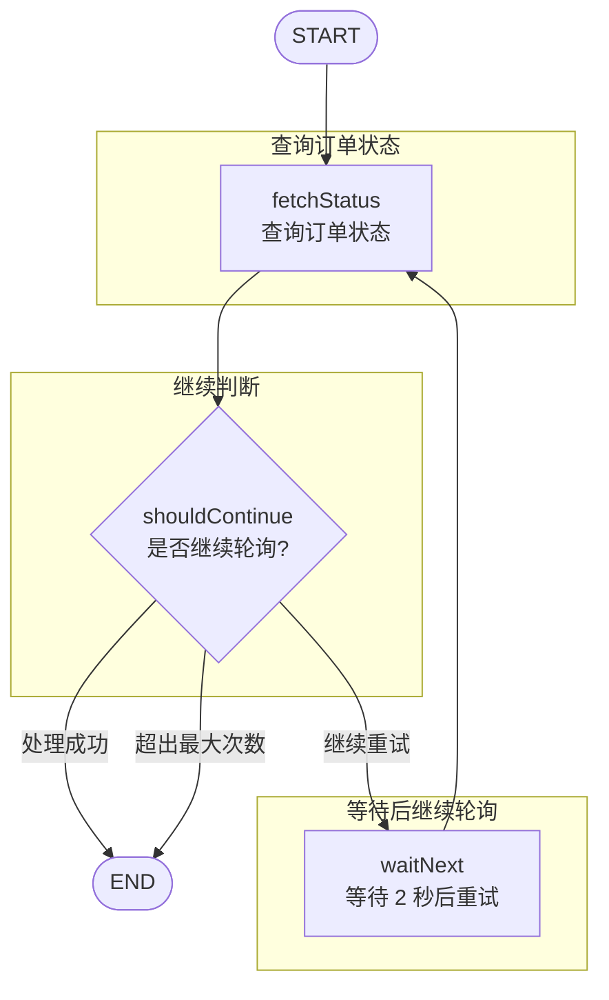

## MapReduce

MapReduce 的模式，一般用于：

1. 拆分人物
2. 并发处理
3. 汇总结果

例如：

1. 批量调用多个外部接口
2. 对里诶宝进行向量化处理
3. 对多个检索结果做合并

例子：对多个关键词并发检索，然后合并为统一答案

1. 用户输入问题
2. Map：使用 MultiQuery 拆分成多个查询，分别发给检索系统
3. Reduce：把多路检索结果合并，去重排序
4. 给LLM最终答案

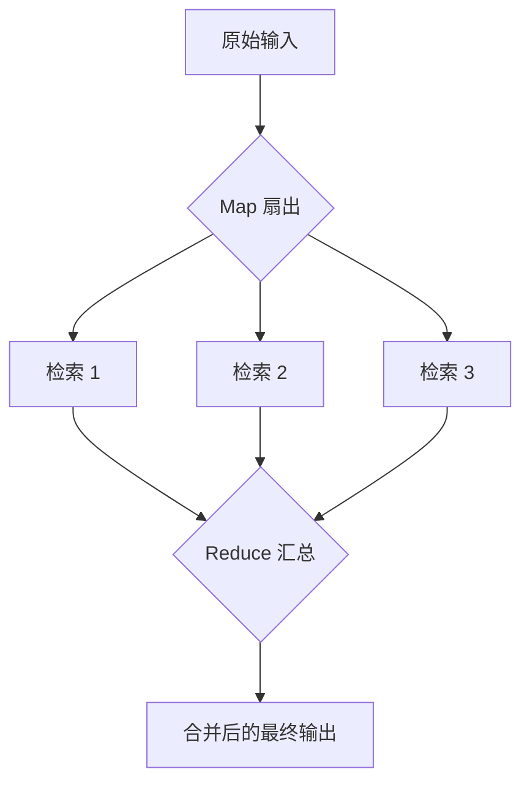

**和并发的区别** ：MapReduce 是基于并发这种能力实现的一种模式

并发是一种能同时跑多个人物的能力 `节点 A →（分发到两个独立节点）→ B、C 同时跑`

也就是：B 和 C 只是并发，不需要相互汇总，A 也没根据输入数据拆分任务。这种叫并发，是一种基本的能力

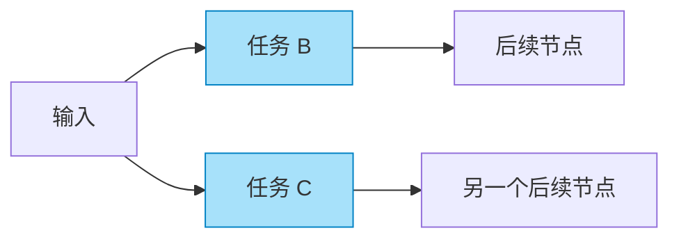

而MapReduce 是基于并发实现的 任务拆分、并发跑、汇总结果 的一种特性吗模式。

例如：输入的数据是 `["A", "B", "C"]`，也就是说是一组数据，接下来会：

- Map：为每个元素创建一个任务，从而让3个任务并发跑
- Reduce：等待3个任务都结束，把结果合并成数组

在这个过程中，有3个关键点：

1. 根据数据动态创建任务数量，例如N条输入会产生N个并发节点
2. 需要等待所有分支完成
3. 最终要把结果收拢为一个合并结果

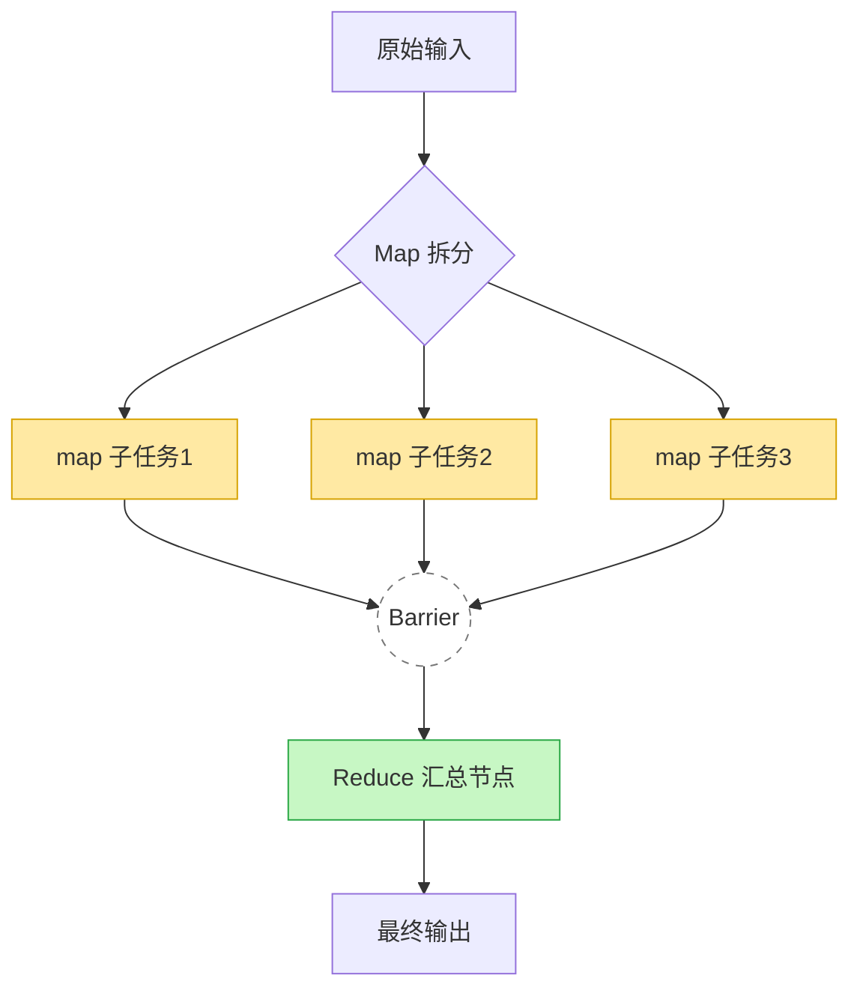

### SendAPI

在LangGraph中，每次调用 `send()` 就相当于在图中派生出了一条新的任务分支，这就是相当于 map 阶段的扇出器。

语法: `new Send(targetNode,state)`

- targetNode：要把任务派发给哪一个节点
- state：发送给该节点的状态数据

假设我们要处理一组列表：

```ts
items = ["A", "B", "C"]
```

Map节点（专门负责派发出多个任务）内部：

```ts
return items.map((item) => new Send("workerNode", { item }));
```

在上面的代码中：

1. 会动态产生3条并发任务
2. 每一条都会流向workerNode
3. 每一条任务所携带的状态数据为{item}

因为 `addEdge` 添加普通边的时候，是**静态边**，也就是不支持运行时增开多条边，永远只有一条路径，一个任务，一个state，因此我们动态产生分支的需求，需要通过 **条件边实现**

```ts
// 这是一个扇出节点
const fanout = (state: TState) => state.items.map((item) => new Send("worker", { item }));
// 添加条件边
graph.addConditionalEdges(START, fanout)
```

完整例子：

```ts
import { StateGraph, START, END, Send } from "@langchain/langgraph";
import { registry } from "@langchain/langgraph/zod";
import { z } from "zod";

// 状态Schema
const Schema = z.object({
  items: z.array(z.string()), // items: ["a", "b", "c"]
  results: z.array(z.string()).register(registry, {
    reducer: {
      fn: (prev: string[], next: string[]) => prev.concat(next), // 结果的一个合并
    },
    default: () => [],
  }),
});

// 根据Schema生成对应的 ts 类型
type TState = z.infer<typeof Schema>;

// map节点
const fanout = (state: TState) =>
  state.items.map((item) => new Send("worker", { item }));

// 负责将小写字母转为大写
const worker = (state: { item: string }) => ({
  results: [state.item.toUpperCase()],
});

// 构建图
const graph = new StateGraph(Schema)
  .addNode("worker", worker)
  .addConditionalEdges(START, fanout)
  .addEdge("worker", END)
  .compile();

const result = await graph.invoke({
  items: ["abc", "def", "ghi"],
});
console.log(result);

```

场景案例：电商风控系统，对一批订单并发打风险分，再统一汇总高危订单与统计报表。

业务需求：

输入：一批待审核订单 orders

- Map 阶段：对每个订单并发调用“风控服务”（可以是 HTTP 服务，也可以是 LLM：是否存在欺诈风险？）
- Reduce 阶段：
  - 收集所有订单的风险评分
  - 计算统计信息（高危订单数量、比例等）
  - 输出一个“高危订单列表 + 简单统计报表”
  - 对应到 LangGraph 的 MapReduce 模式：

1. fanoutOrders(Map)：对 orders 做 Send("scoreOrder", { order })
2. scoreOrder(Worker)：调用风控服务，返回 { orderId, riskScore, level }
3. aggregateRisk(Reduce)：从 riskResults[] 中做汇总，生成最终输出

## Command 指令

在节点内部，根据计算结果，动态决定要跳到那个下一节点，而不是提前把所有边写死（节点：负责做事情。）、（边：决定走哪一条路线）：

传统方案：

```ts
return { ...state update... }
```

而流程走向由 graph 的 `.addEdge` 固定决定的，也就是说**在构建图的时候，流程走向就确定下来了** ，无法进行动态跳转

因此，LangGraph 提供了 `Command` 的特性，让更新节点和跳转节点能够合并在一起。

```ts
// Command是一个类，对外返回一个Command的实例对象
new Command({
  update: ...,  
  goto: ...,  
})
```

撇只对象包括:

- update 更新节点
- goto 要跳转节点

例如:

```ts
import { Command } from "@langchain/langgraph";

graph.addNode("myNode", (state) => {
  // 返回一个Command实例对象
  return new Command({
    update: { foo: "bar" },  // 更新状态
    goto: "myOtherNode",     // 要跳转到哪一个节点 
  });
});
```

在上面的myNode节点中：

- 更新当前状态的字段 foo；
- 执行完后直接跳转到 myOtherNode。

当一个节点使用 `Command` 来做更新跳转时，需要指定一个**允许列表（数组）**,这相当于是一个**路径白名单** ，列出了所有可能的去向。

```ts
import { Command } from "@langchain/langgraph";

// 1. 节点名称
// 2. 节点对应的回调函数：返回一个Command的实例对象
// 3. 配置对象：ends（允许列表）
graph.addNode("myNode", (state) => {
  return new Command({
    update: { foo: "bar" },  // 更新状态
    goto: "B",     					 // 跳转下一个节点
  });
},{ 
  ends: ["B", "C"] 					 // 允许列表
});

```

> 条件分支通过路由函数决定接下来走那个边，Command 通过 `goto` 字段决定下一个节点是谁。

条件边写的路由逻辑是**图结构层面的**，A执行完 → 图外：下一步去哪？ → 路由函数返回结果 → 图外按照流程走

```ts
graph.addConditionalEdges("A", (state) => {
  if (state.foo === "bar") return "B";
  else return "C";
});
```

这里的A函数和，自己不知道下一个是谁，是外部控制你起决定的。而 Command的逻辑是节点自己决定跳哪。

```ts
graph.addNode("A", (state) => {
  if (state.foo === "bar") {
    return new Command({
      update: { foo: "baz" },
      goto: "B",
    });
  }
});
```

流程像是：A 执行时 → 自己计算出结果 + 自己决定去哪 → 直接返回 Command。

A 自己完成了“计算 + 更新 + 跳转”三件事，图外不再需要再问一次“去哪”。


两者具体区别

| 特性           | 条件分支                     | Command                         |
| -------------- | ---------------------------- | ------------------------------- |
| 定义位置       | 图结构层（Graph 设计阶段）   | 节点函数内部（运行阶段）        |
| 逻辑归属       | 结构控制（流程图层）         | 业务逻辑（节点层）              |
| 能否更新 state | 不能更新，只决定方向         | 可以更新并跳转                  |
| 调用时机       | 节点执行完之后（外部控制流） | 节点执行过程中（内部决定）      |
| 使用场景       | 固定的流程路由、if/else 分支 | 动态决策、代理交接、HITL 恢复等 |


Commadn 常用于 **跨子图跳转** 、**人工接入、人工干预、中断**

由于**条件边跳转范围仅限于当前图内** ,无法直接跨出子图跳到父图或兄弟子图中，例如：

```bash
父图：
  ├── 子图A（负责分析）
  ├── 子图B（负责生成）
```

如果子图A分析完想直接跳到父图中的子图B，这时条件边就做不到，因为它只识别当前子图的节点。而通过Command就能够很好的解决这个问题：

```ts
return new Command({
  update: { result: "analysis done" },
  goto: "SubgraphB",
  graph: Command.PARENT, // 指定跳转到父图
});
```


人工接入：在LangGraph的执行流程中，有些节点可能需要等待人工输入或外部事件的反馈才能继续执行，比如：
- 等待用户确认某个决策
- 等待客服或审核人员填写信息
- 等待外部系统的异步回调

在这类场景下，普通的节点返回值或条件边无法暂停图的运行，而Command可以做到这点，例如：

- 一个客服系统程序

```bash
AI回复 → 等待用户确认 → 继续执行
```

执行到“等待用户输入”时，流程需要暂停。这时系统会：

```bash
// 暂停：在节点里
await interrupt({ reason: "需要人工确认报价" });
```

用户输入后，系统会再恢复。这个恢复动作就是用Command完成的：

```ts
// 恢复：拿到外部输入后（继续同一节点的后续逻辑）
return new Command({
  resume: { approved: true, note: "人工已确认" },
  goto: "NextNode",
});

```

## 工具调用

一个简单的模拟天气查询的工具

```ts
import { z } from "zod";
import { tool } from "@langchain/core/tools";

// 工具方法参数 schema
const schema = z.object({
  location: z.string().min(1).describe("城市名称，例如：北京、上海"),
  unit: z
    .enum(["celsius", "fahrenheit"])
    .default("celsius")
    .describe("温度单位"),
});
// 根据Schema顺便生成ts类型
type WeatherInput = z.infer<typeof schema>;


// 这里我们仅作模拟，不对接第三方天气应用
const func = ({ location, unit = "celsius" }: WeatherInput): string => {
  const weather_info = {
    location,
    temperature: "22",
    unit,
    forecast: ["晴朗 ☀️", "微风 🌬️"],
  };
  return JSON.stringify(weather_info);
};

```


最后，调用 langchain 提供的 tool 方法，该方法会把：
- 一个普通的 JS 函数
- 参数校验 schema
- 描述


包装成 langchain 里可以被 LLM/Agent 调用的工具对象。

```ts
const weather = tool(func, {
  name: "weather",
  description:
    "查询指定城市当前天气。返回 JSON 字符串，包含温度、单位与简短描述。",
  schema,
});

export default [weather];
```

创建智能体并应用工具

```ts
import { createAgent } from "langchain";
import { ChatOpenAI } from "@langchain/openai";
import tools from "../tools/index.ts";

// 模型实例类型
export type ChatModel = ChatOpenAI;

// 智能体类型
export type Agent = ReturnType<typeof createAgent>;

// 模型
const model: ChatModel = new ChatOpenAI({
  model: "gpt-4.1-mini",
  temperature: 0,
});

// 智能体
const agent: Agent = createAgent({
  model,
  tools,
  systemPrompt: "你是一个聪明的AI智能机器人",
});

export default agent;
```


## 子图

子图就是在一张图里还嵌套了另外一张图，在LangGraph 中子图的常见应用场景：

1. 构建多智能体系统
2. 在多个图中复用统一节点
3. 分布式开发
  - 当希望不同团队独立开发图的不同部分的时候，可以将每个部分拆分为一个子图
  - 只要子图的接口（输入输出 Schema） 保持一致，父图就可以在无需了解子图内部细节的情况下进行构建


使用子图的两种方式：

1. 父图把输入传给子图
2. 子图返回结果回传给父图

这种模式下，子图看起来就像父图的一个函数，父流程不关心子流程内部的 节点、状态、步骤。

父图和子图之间数据通过输入/输出 schema 明确传递，子图内部使用的 state，不直接暴露给父图

```bash
父图 NodeA → 子图(…) → 父图继续执行
```


场景：

父图负责父图负责处理“用户下单流程”。当用户下单时，父图会调用“风控子图”去判断订单是否有风险。

- 子图内部有多步，例如：IP 检测 + 金额检测。
- 父图调用子图 → 获取风控结果 → 决定是否继续下单或拒绝。


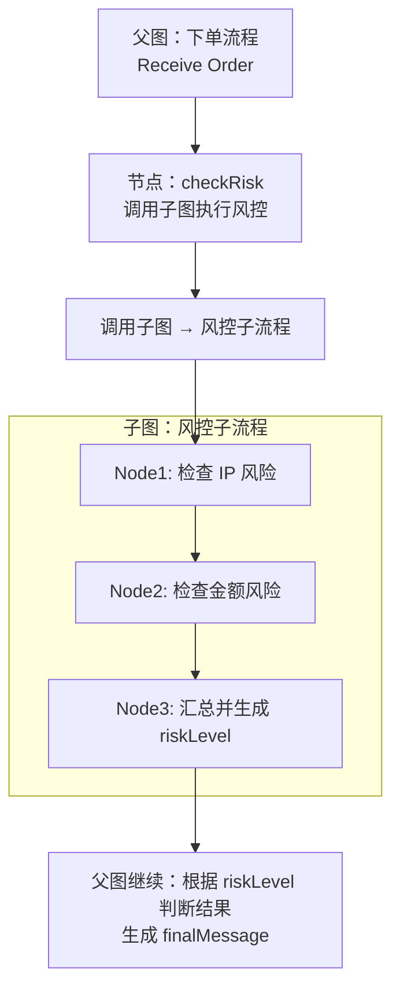


**将子图添加为节点**

子图直接“嵌入”到父图内，成为父图的一部分，与父图共享 state 的 key。

```bash
父图节点  ===>  { 子图内部的很多节点 } ===> 父图下一个节点
```


看起来像父图的一个 node，但内部却是一个完整的 graph。这样，我们就可以：

- 子图与父图使用同一个 state（共享部分或全部 key）
- 子图内部的 node 可以读写父图 state

子图不再是一个“黑盒”，而是父图的一部分

适用场景：

- 多团队协作，把一段流程拆成一个子图
- 想复用一段常用流程（比如全局日志链路、消息管道）
- 子图需要访问父图的多个 state 字段，不止输入/输出


场景：

客户注册需要执行复杂的 KYC（身份核验）流程：

子图负责：

- OCR 身份证识别
- 人脸对比
- 风险评分
- 写入结果到父图的 shared state

父图负责：

- 收集用户信息
- 调用 KYC 子图验证
- 根据验证结果决定是否注册成功


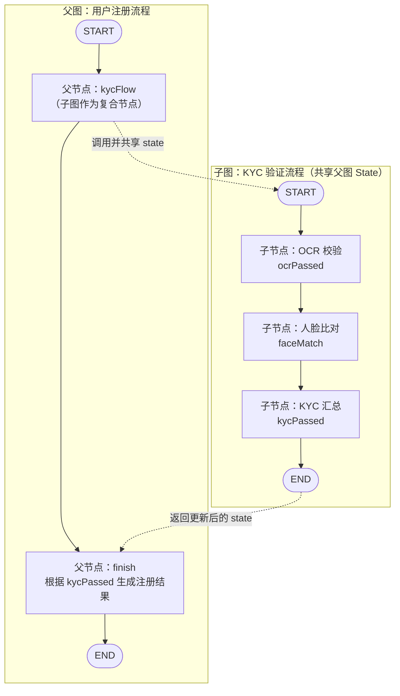

